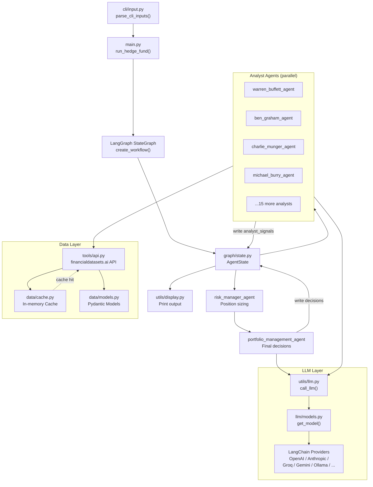
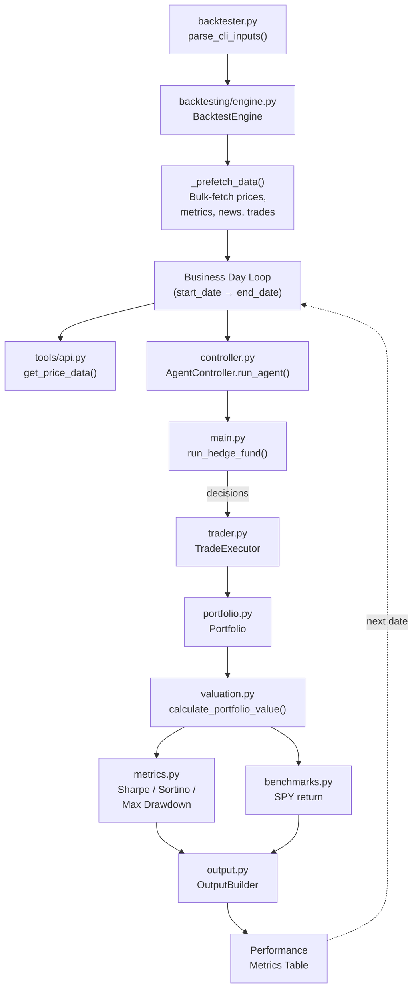
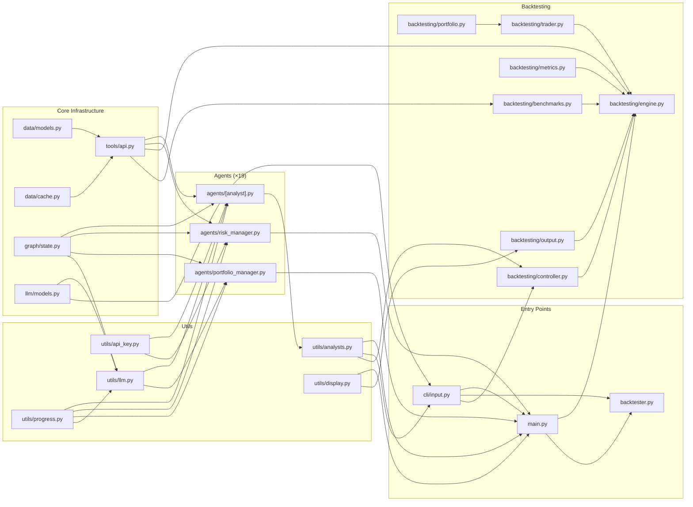

# Developer Guide

## Table of Contents

1. [System Overview](#1-system-overview)
2. [Architecture Flow Diagram](#2-architecture-flow-diagram)
3. [Module Reference](#3-module-reference)
   - [Entry Points](#31-entry-points)
   - [Data Layer](#32-data-layer)
   - [LLM Layer](#33-llm-layer)
   - [Graph / State](#34-graph--state)
   - [Agents](#35-agents)
   - [Utils](#36-utils)
   - [CLI](#37-cli)
   - [Backtesting](#38-backtesting)
4. [AgentState: The Shared Data Bus](#4-agentstate-the-shared-data-bus)
5. [Adding a New Analyst Agent](#5-adding-a-new-analyst-agent)
6. [Adding a New LLM Provider](#6-adding-a-new-llm-provider)
7. [Backtesting Internals](#7-backtesting-internals)
8. [Web App Backend](#8-web-app-backend)
9. [Environment Variables](#9-environment-variables)
10. [Dependency Graph](#10-dependency-graph)

---

## 1. System Overview

The AI Hedge Fund is a multi-agent trading decision system built on [LangGraph](https://github.com/langchain-ai/langgraph). It is **not** a live trading system — it produces buy/sell/hold recommendations for educational and research purposes.

The system has two modes of operation:

- **Live analysis** (`src/main.py`): given a set of tickers and a date range, all selected analysts run in parallel, produce signals, and a portfolio manager makes final decisions.
- **Backtesting** (`src/backtester.py`): the live analysis is replayed over every business day in a historical range, tracking portfolio value against a SPY benchmark.

Both modes share the exact same LangGraph workflow and agent implementations. The backtester simply calls `run_hedge_fund()` repeatedly in a date loop.

---

## 2. Architecture Flow Diagram

### Live Analysis



### Backtesting Loop



---

## 3. Module Reference

### 3.1 Entry Points

| File | Purpose |
|------|---------|
| `src/main.py` | Builds and invokes the LangGraph workflow; defines `run_hedge_fund()` |
| `src/backtester.py` | CLI entry point for backtesting; delegates to `BacktestEngine` |

`run_hedge_fund()` is the core callable — it accepts tickers, dates, portfolio state, model config, and analyst selection, builds a fresh `StateGraph`, runs it, and returns `{decisions, analyst_signals}`.

### 3.2 Data Layer

| File | Purpose |
|------|---------|
| `src/data/models.py` | Pydantic models for all financial API response types: `Price`, `FinancialMetrics`, `LineItem`, `InsiderTrade`, `CompanyNews`, and their list-wrapper `*Response` equivalents |
| `src/data/cache.py` | `Cache` class: per-ticker in-memory dicts for prices, metrics, line items, insider trades, and news. Deduplicates by key field on merge so repeated calls for overlapping date ranges don't produce duplicates |
| `src/tools/api.py` | **The only file that makes external HTTP calls.** Wraps the [financialdatasets.ai](https://financialdatasets.ai) API. Handles 429 rate-limit retries with linear backoff (60s, 90s, 120s). All agents fetch data through the functions exported here |

Key functions in `tools/api.py`:

```python
get_prices(ticker, start_date, end_date)          # OHLCV price bars
get_price_data(ticker, start_date, end_date)       # Returns a DataFrame
get_financial_metrics(ticker, end_date, limit)     # P/E, EV/EBITDA, etc.
search_line_items(ticker, items, end_date, limit)  # Income / balance / CF items
get_insider_trades(ticker, end_date, ...)          # SEC Form 4 data
get_company_news(ticker, end_date, ...)            # News articles
get_market_cap(ticker, end_date)                   # Market capitalisation
```

Free tickers (no API key needed): `AAPL`, `GOOGL`, `MSFT`, `NVDA`, `TSLA`.

### 3.3 LLM Layer

| File | Purpose |
|------|---------|
| `src/llm/models.py` | `ModelProvider` enum, `LLMModel` Pydantic model, `get_model()` factory, `has_json_mode()` flag, `LLM_ORDER` / `OLLAMA_LLM_ORDER` lists loaded from JSON |
| `src/llm/api_models.json` | Cloud model definitions (OpenAI, Anthropic, Groq, Gemini, xAI, etc.) |
| `src/llm/ollama_models.json` | Local model definitions for Ollama |
| `src/utils/llm.py` | `call_llm()`: the single LLM call wrapper used by every agent. Handles structured output via `with_structured_output(..., method="json_mode")` for models that support it, or manual JSON extraction from markdown fences for those that don't (DeepSeek, Gemini, some Ollama models). Includes retry logic with up to 3 attempts and a `default_factory` fallback |

**How model resolution works in `call_llm()`:**

1. If `state["metadata"]["request"]` has a `get_agent_model_config(agent_name)` method, use that (per-agent override from the web app).
2. Otherwise fall back to `state["metadata"]["model_name"]` / `model_provider` (global CLI config).
3. Otherwise default to `gpt-4.1` / `OpenAI`.

### 3.4 Graph / State

`src/graph/state.py` defines:

```python
class AgentState(TypedDict):
    messages: Annotated[Sequence[BaseMessage], operator.add]   # appended
    data:     Annotated[dict[str, any], merge_dicts]           # merged
    metadata: Annotated[dict[str, any], merge_dicts]           # merged
```

The `merge_dicts` reducer means multiple agents writing to `data["analyst_signals"]` will be merged, not overwritten. See [§4](#4-agentstate-the-shared-data-bus) for full schema.

`show_agent_reasoning(output, agent_name)` is a debug helper that pretty-prints an agent's structured output when `show_reasoning=True`.

### 3.5 Agents

All 19 agent files in `src/agents/` follow the same contract:

```
Input:  AgentState
Output: partial AgentState update — writes to state["data"]["analyst_signals"][ticker]
```

Each analyst signal has the shape:
```python
{
    "signal":     "bullish" | "bearish" | "neutral",
    "confidence": int,        # 0–100
    "reasoning":  str,
}
```

Every analyst agent:
1. Reads `tickers`, `start_date`, `end_date`, `portfolio` from `state["data"]`
2. Fetches relevant financial data via `tools/api.py`
3. Constructs a `ChatPromptTemplate` embodying that investor's philosophy
4. Calls `call_llm()` with a Pydantic output model (e.g. `WarrenBuffettSignal`)
5. Writes results to `state["data"]["analyst_signals"][ticker][agent_key]`

**Special agents:**

- `risk_manager.py`: reads all analyst signals + price history, computes volatility-based position limits (max long/short shares per ticker), writes to `state["data"]["risk_analysis"]`
- `portfolio_manager.py`: reads risk limits + all analyst signals, calls `call_llm()` to produce final `PortfolioDecision` per ticker (`buy/sell/short/cover/hold` + quantity), writes to the final `HumanMessage` in `state["messages"]`

### 3.6 Utils

| File | Purpose |
|------|---------|
| `utils/analysts.py` | `ANALYST_CONFIG` dict — single source of truth for all analysts; `get_analyst_nodes()` returns `{key: (node_name, func)}` used by `main.py`; `get_agents_list()` for the web API |
| `utils/llm.py` | `call_llm()` — see §3.3 |
| `utils/api_key.py` | `get_api_key_from_state()` — extracts `FINANCIAL_DATASETS_API_KEY` from `state["metadata"]["request"].api_keys`, then from `state["metadata"]`, then from `os.environ` |
| `utils/progress.py` | Singleton `progress` object — wraps Rich / colorama for per-agent status lines during a run |
| `utils/display.py` | `print_trading_output()` and `format_backtest_row()` — terminal table formatters |
| `utils/visualize.py` | `save_graph_as_png()` — renders the LangGraph as a PNG using Mermaid |
| `utils/ollama.py` | `ensure_ollama_and_model()` — checks that Ollama is installed and the requested model is pulled |
| `utils/docker.py` | Docker helpers used by the web app setup scripts |

### 3.7 CLI

`src/cli/input.py` provides `parse_cli_inputs()`, which handles both flag-only (non-interactive, e.g. from the backtester or programmatic use) and interactive `questionary` prompts. It returns a dataclass with:

```python
tickers: list[str]
start_date: str          # YYYY-MM-DD
end_date: str
selected_analysts: list[str]
model_name: str
model_provider: str
show_reasoning: bool
initial_cash: float
margin_requirement: float
```

### 3.8 Backtesting

See [§7 Backtesting Internals](#7-backtesting-internals) for a detailed breakdown.

| File | Role |
|------|------|
| `backtesting/types.py` | All TypedDicts and enums: `Action`, `PortfolioSnapshot`, `AgentDecision`, `AgentOutput`, `PerformanceMetrics`, `PortfolioValuePoint` |
| `backtesting/portfolio.py` | `Portfolio` class — manages cash, long/short positions, cost-basis averaging, margin, realized gains |
| `backtesting/trader.py` | `TradeExecutor` — maps `Action` enum to `Portfolio.apply_*` calls |
| `backtesting/controller.py` | `AgentController` — normalizes the call to `run_hedge_fund()` and coerces agent output |
| `backtesting/engine.py` | `BacktestEngine` — orchestrates the full date loop |
| `backtesting/valuation.py` | `calculate_portfolio_value()` and `compute_exposures()` — computes NAV and long/short exposure ratios |
| `backtesting/metrics.py` | `PerformanceMetricsCalculator` — Sharpe, Sortino, max drawdown (252 trading days, 4.34% risk-free rate) |
| `backtesting/benchmarks.py` | `BenchmarkCalculator` — computes SPY return over the same period using cached price data |
| `backtesting/output.py` | `OutputBuilder` — assembles the per-day table rows for terminal display |
| `backtesting/cli.py` | `main()` entry point registered as the `backtester` Poetry script |

---

## 4. AgentState: The Shared Data Bus

`AgentState` is the only object passed between all nodes in the graph. Understanding its schema is essential for working with any agent.

```python
{
    "messages": [HumanMessage("Make trading decisions...")],  # grows via append

    "data": {
        # Inputs — set by main.py before graph invocation
        "tickers":        ["AAPL", "NVDA"],
        "portfolio":      { "cash": 100000, "positions": {...}, ... },
        "start_date":     "2024-01-01",
        "end_date":       "2024-03-01",

        # Outputs — written progressively by agents
        "analyst_signals": {
            "AAPL": {
                "warren_buffett_agent": {
                    "signal": "bullish",
                    "confidence": 85,
                    "reasoning": "..."
                },
                # ...one entry per analyst that ran
            }
        },
        "risk_analysis": {
            "AAPL": {
                "max_position_size": 1000,
                "max_short_size": 500,
                "reasoning": "..."
            }
        }
    },

    "metadata": {
        "show_reasoning":  False,
        "model_name":      "gpt-4.1",
        "model_provider":  "OpenAI",
        # Web app only:
        "request":         <HedgeFundRequest with .api_keys, .get_agent_model_config()>
    }
}
```

The `merge_dicts` reducer on `data` means that when multiple analyst nodes write `{"analyst_signals": {"AAPL": {"warren_buffett_agent": ...}}}`, they are shallowly merged rather than overwriting each other. Be careful: a second level of nesting is not deeply merged — each analyst must write only its own key.

---

## 5. Adding a New Analyst Agent

### Step 1 — Create the agent file

Create `src/agents/my_investor.py`. The minimum structure:

```python
from pydantic import BaseModel, Field
from typing_extensions import Literal
from langchain_core.prompts import ChatPromptTemplate
from langchain_core.messages import HumanMessage

from src.graph.state import AgentState, show_agent_reasoning
from src.tools.api import get_financial_metrics, search_line_items  # whatever you need
from src.utils.api_key import get_api_key_from_state
from src.utils.llm import call_llm
from src.utils.progress import progress


class MyInvestorSignal(BaseModel):
    signal: Literal["bullish", "bearish", "neutral"]
    confidence: int = Field(description="Confidence 0-100")
    reasoning: str = Field(description="Reasoning for the decision")


def my_investor_agent(state: AgentState, agent_id: str = "my_investor_agent"):
    data = state["data"]
    tickers = data["tickers"]
    end_date = data["end_date"]
    start_date = data["start_date"]
    api_key = get_api_key_from_state(state, "FINANCIAL_DATASETS_API_KEY")

    analyst_signals = {}

    for ticker in tickers:
        progress.update_status(agent_id, ticker, "Fetching data")

        metrics = get_financial_metrics(ticker, end_date, api_key=api_key)
        # ... fetch whatever data this investor cares about

        progress.update_status(agent_id, ticker, "Calling LLM")

        prompt = ChatPromptTemplate.from_messages([
            ("system", "You are investing in the style of My Investor..."),
            ("human", "Analyze {ticker} given: {data}"),
        ]).format_messages(ticker=ticker, data=str(metrics))

        result = call_llm(
            prompt=prompt,
            pydantic_model=MyInvestorSignal,
            agent_name=agent_id,
            state=state,
        )

        analyst_signals[ticker] = {
            agent_id: {
                "signal": result.signal,
                "confidence": result.confidence,
                "reasoning": result.reasoning,
            }
        }

        if state["metadata"].get("show_reasoning"):
            show_agent_reasoning(analyst_signals[ticker][agent_id], agent_id)

        progress.update_status(agent_id, ticker, "Done")

    return {"data": {"analyst_signals": analyst_signals}}
```

### Step 2 — Register in ANALYST_CONFIG

Open `src/utils/analysts.py` and add:

```python
from src.agents.my_investor import my_investor_agent

ANALYST_CONFIG = {
    # ... existing entries ...
    "my_investor": {
        "display_name": "My Investor",
        "description": "Short tagline",
        "investing_style": "One sentence description of strategy.",
        "agent_func": my_investor_agent,
        "type": "analyst",
        "order": 19,   # next available integer
    },
}
```

That's it. The agent is now available in both the CLI interactive selector and the web app.

---

## 6. Adding a New LLM Provider

### Step 1 — Add to the enum

In `src/llm/models.py`, add a value to `ModelProvider`:

```python
class ModelProvider(str, Enum):
    # ...
    MY_PROVIDER = "MyProvider"
```

### Step 2 — Add model definitions to JSON

Add entries to `src/llm/api_models.json`:

```json
{
  "display_name": "My Model (Large)",
  "model_name": "my-model-large",
  "provider": "MyProvider"
}
```

### Step 3 — Instantiate in `get_model()`

In `src/llm/models.py`, extend the `get_model()` function:

```python
elif provider == ModelProvider.MY_PROVIDER:
    from langchain_myprovider import ChatMyProvider
    return ChatMyProvider(model=model_name, api_key=os.environ.get("MY_PROVIDER_API_KEY"))
```

### Step 4 — Handle JSON mode

If your provider does not support `method="json_mode"` in structured output, override `has_json_mode()` in `LLMModel`:

```python
def has_json_mode(self) -> bool:
    if self.provider == ModelProvider.MY_PROVIDER:
        return False
    # ...
```

When `has_json_mode()` returns `False`, `call_llm()` will ask the model to output JSON inside a `\`\`\`json` fence and parse it manually.

---

## 7. Backtesting Internals

### How it reuses the live system

`BacktestEngine` does **not** have its own agent logic. At each date it calls `AgentController.run_agent()`, which calls `run_hedge_fund()` from `src/main.py`. This means the backtest is a true replay of the live system — any improvement to an analyst agent automatically applies to backtests.

### Date loop

```
for each business day in [start_date, end_date]:
    lookback_start = current_date - 1 month
    
    1. Fetch current prices for all tickers          (get_price_data)
    2. Run hedge fund for [lookback_start, current_date]  (AgentController → run_hedge_fund)
    3. Execute decisions against Portfolio            (TradeExecutor)
    4. Compute portfolio NAV and exposures            (valuation.py)
    5. Update performance metrics                    (PerformanceMetricsCalculator)
    6. Compute SPY benchmark return                  (BenchmarkCalculator)
    7. Append row to output table                    (OutputBuilder)
```

Data for the entire date range is pre-fetched before the loop starts (`_prefetch_data`) so all API calls populate the cache upfront, and subsequent calls during the loop are served from memory.

### Portfolio model

`Portfolio` tracks:
- `cash`: current cash balance
- `positions[ticker].long` / `.short`: share counts
- `positions[ticker].long_cost_basis` / `.short_cost_basis`: weighted average cost
- `positions[ticker].short_margin_used`: margin reserved for open short
- `margin_used`: total margin in use across all shorts
- `margin_requirement`: fraction of short position value required as margin
- `realized_gains[ticker].long` / `.short`: cumulative realized PnL

All trade methods (`apply_long_buy`, `apply_long_sell`, `apply_short_open`, `apply_short_cover`) are cash-constrained: they silently reduce quantity to the affordable maximum rather than raising errors.

### Performance metrics

Computed by `PerformanceMetricsCalculator` over the equity curve:

| Metric | Description |
|--------|-------------|
| Sharpe ratio | Annualized excess return / annualized volatility (rf = 4.34%) |
| Sortino ratio | Annualized excess return / annualized downside deviation |
| Max drawdown | Maximum peak-to-trough decline in portfolio value |

---

## 8. Web App Backend

The web app at `app/backend/` is a FastAPI application that wraps `src/` as a library.

### Entry point

```
app/backend/main.py  →  app.include_router(api_router)
```

### Route summary

| Route module | Endpoints |
|---|---|
| `routes/hedge_fund.py` | `POST /api/hedge-fund/run` — runs analysis (streaming SSE) |
| `routes/flows.py` | CRUD for saved analysis runs |
| `routes/flow_runs.py` | Retrieval of run results |
| `routes/storage.py` | File/result persistence |
| `routes/language_models.py` | `GET /api/models` — list available models |
| `routes/api_keys.py` | Store/retrieve encrypted API keys |
| `routes/ollama.py` | Ollama status, model pull |
| `routes/health.py` | `GET /ping` |

### Services

Business logic lives in `app/backend/services/`:

| Service | Role |
|---------|------|
| `agent_service.py` | Invokes `run_hedge_fund()` and streams results as SSE |
| `backtest_service.py` | Wraps `BacktestEngine` for the web context |
| `graph.py` | Builds the LangGraph workflow (mirrors `main.py` but for the API context) |
| `portfolio.py` | Portfolio construction helpers |
| `api_key_service.py` | Encrypted API key storage/retrieval |
| `ollama_service.py` | Async Ollama status checks and model management |

### Database

SQLite via SQLAlchemy. Models in `app/backend/database/models.py`; connection in `database/connection.py`; migrations managed by Alembic (`app/backend/alembic/`).

---

## 9. Environment Variables

| Variable | Required | Purpose |
|----------|----------|---------|
| `OPENAI_API_KEY` | One of these is required | OpenAI models |
| `ANTHROPIC_API_KEY` | One of these is required | Claude models |
| `GROQ_API_KEY` | One of these is required | Groq-hosted models |
| `DEEPSEEK_API_KEY` | Optional | DeepSeek models |
| `GOOGLE_API_KEY` | Optional | Gemini models |
| `XAI_API_KEY` | Optional | xAI (Grok) models |
| `GIGACHAT_CREDENTIALS` | Optional | GigaChat models |
| `AZURE_OPENAI_API_KEY` | Optional | Azure OpenAI endpoint |
| `FINANCIAL_DATASETS_API_KEY` | Optional | Required for any ticker other than AAPL, GOOGL, MSFT, NVDA, TSLA |

All variables are loaded from `.env` in the project root via `python-dotenv`. Copy `.env.example` to `.env` to get started.

---

## 10. Dependency Graph

The arrows show "imports from":


